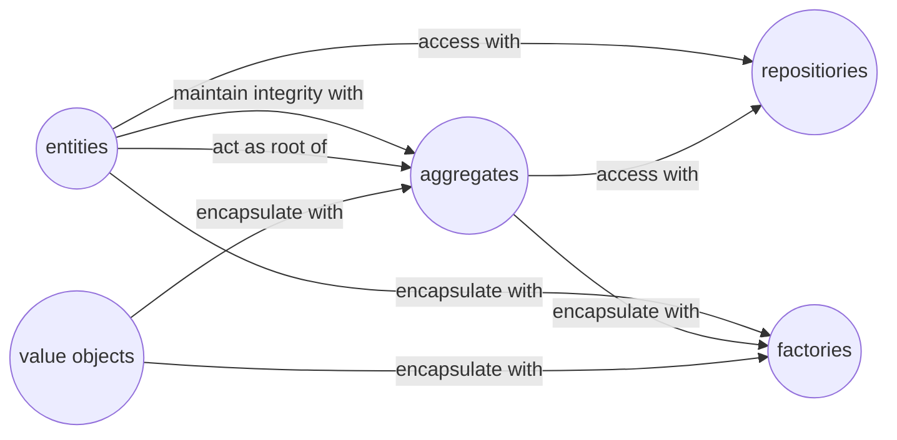

## 有關 Domain Driven Design 

```mermaid

graph LR

  entities((entities))
  repositories((repositiories))
  aggregates((aggregates))
  value_objects((value objects))
  factories((factories))

  entities -- access with --> repositories
  aggregates -- access with --> repositories
  entities -- maintain integrity with --> aggregates
  entities -- act as root of --> aggregates
  entities -- encapsulate with --> factories
  aggregates -- encapsulate with --> factories
  value_objects -- encapsulate with --> factories
  value_objects -- encapsulate with --> aggregates

```

## 資源網站

1. [有關 Dapper Column Mapping 的資源](https://github.com/alexander-87/Dapper.FluentColumnMapping)