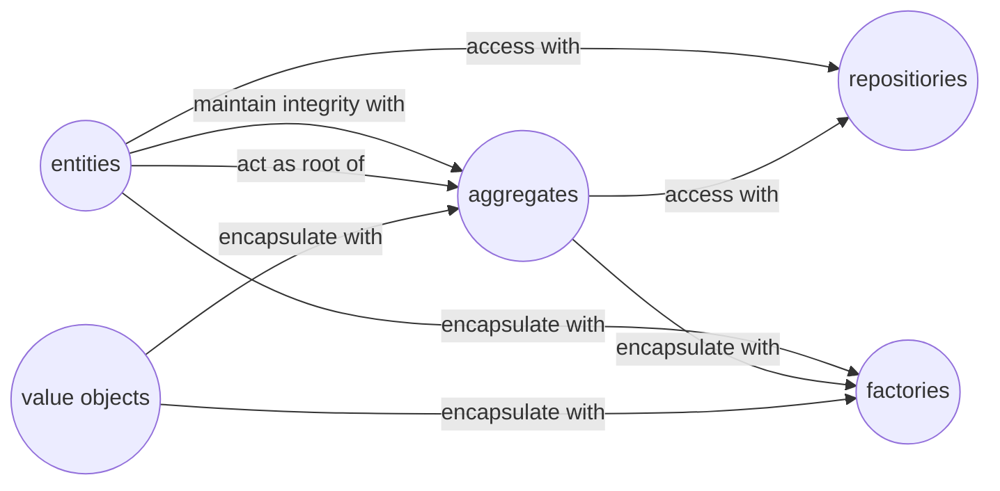

## 有關 Domain Driven Design 



## 資源網站

1. [有關 Dapper Column Mapping 的資源](https://github.com/alexander-87/Dapper.FluentColumnMapping)
1. [有關 Domain Event 的文章](https://docs.microsoft.com/en-us/dotnet/architecture/microservices/microservice-ddd-cqrs-patterns/domain-events-design-implementation)
1. [Processing multiple aggregates - transactional vs eventual consistency](http://www.kamilgrzybek.com/design/processing-multiple-aggregates-transactional-vs-eventual-consistency/)

## Domain 

### What is a domain event?

Domain Event(領域事件)是一個在想讓其他部分的 Domain(或說是某個 Sub-Domain)去知道有事情發生了, 你該做出相應回應的一中事件。
注意, Microsoft 的文章有堆次強調,處理 domain event 的 handler, 要是 other part of the same domain, 這點跟 message system(AMQP實作的)不一樣。
有人會說 Domain Event 可以視為更動 Domain Event 所引起的一個副作用(Side Effect), 而實作 Domain Event 的好處就是, 可以
讓這個副作用便的相當明確, 也會變得好處理一些。

實作 Domain Event 的時候要注意, 一個 Domain Event 起碼要對應到一個 Domain Event Handler, 這種概念就像是, 做完一件事產生的副作用, 一定得處理一下。
拉完屎會讓屁股變髒, 一定得處理一下, 不然後果可能會越滾越大...

實作 Domain Event 得時候要注意, Domain 發生的變化和處理 domain event 所產生的變化, 要碼一起成功, 要碼一起失敗, 不然會變成產生出來的副作用沒有被解決, 
然後雪球可能會越滾越大。這概念跟 database 的 transaction 很像。


### Domain events as a perferred way to trigger side effects accross multiple aggregates wiyhin the same domain

如果說你現在要執行一個 Command, 這個 Command 跟一個 Aggregate 相關, 而這個 Aggregate 必須要其他 Aggregate 的幫助下才能完成這命令要它作出的改變。
這個時候, 你混發現 Doman Event 是個好東西。
Domain Event 會 (propagate state changes across multiple aggregates wiyhnin the same domain model)傳播狀態改變給參與到的所有Aggregates, 
當然, 這些 Aggreagtes 會在同一個領域事件(Domian Model)當中。


__這章節還沒讀完跟翻譯完__


### Implement domain events

blablabla

#### Raise domain events

會有多種方式去完成, 有個大佬叫 Udi Dahan 提出了一個[方法](https://udidahan.com/2008/08/25/domain-events-take-2/), 但這方法會立刻處理 Domain event 造成的 side effect,
這樣會讓 test 或是 Debug 敝的困難, 因為 test 或是 Debug 常常是要專注在一個 aggregate 內部而已。
以下將討論另外一種方式

#### The deferred approach to raise and dispatch events

比起立即處理 domain event 的 side effect, 把 domain event 起來, 並且在 commit transaction(好比 ef core 的 save change) 的時候 dispatch 這些 event 然後處理他們, 這種方式可以幫助到程式開發(unit test 和 debug 的部分)。

決定 dispatch 要在 commit the transaction 之前或是之後是很重要的。因為他會引響, 你想將 side effect 做出的變放在同一個 transaction 或是想放在另外的 transaction。
放在後面,就是這一系列的動作, 只要中間有出錯, 那就是全部都不會更動。放在前面,反之亦然。

以下就來個實作:

```c#
public abstract class AggregateRoot
{

    #region 跟事件有關

    private List<IDomainEvent> _events;
    
    /// <summary>
    /// 事件
    /// </summary>
    public List<IDomainEvent> Events => _events;

    /// <summary>
    /// 增加事件
    /// </summary>
    /// <param name="event"></param>
    protected void AddEvent(IDomainEvent @event)
    {
        Modify();
        _events = _events ?? new List<IDomainEvent>();
        _events.Add(@event);
    }

    /// <summary>
    ///  清掉所有 event
    /// </summary>
    public void ClearEvents() => _events.Clear();

    #endregion
    
    // ...
}
```

dispatch events 會發生在要 commit transactions 的時候, 以下是一個例子:

```c#
// EF Core DbContext
public class OrderingContext : DbContext, IUnitOfWork
{
    // ...
    public async Task<bool> SaveEntitiesAsync(CancellationToken cancellationToken = default(CancellationToken))
    {
        // Dispatch Domain Events collection.
        // Choices:
        // A) Right BEFORE committing data (EF SaveChanges) into the DB. This makes
        // a single transaction including side effects from the domain event
        // handlers that are using the same DbContext with Scope lifetime
        // B) Right AFTER committing data (EF SaveChanges) into the DB. This makes
        // multiple transactions. You will need to handle eventual consistency and
        // compensatory actions in case of failures.
        await _mediator.DispatchDomainEventsAsync(this);

        // After this line runs, all the changes (from the Command Handler and Domain
        // event handlers) performed through the DbContext will be committed
        var result = await base.SaveChangesAsync();
    }
}
```

## SaveChanges() vs Commit()

簡單來說,自己下過 Transaction 的情況下 SaveChange 是拿來下Davepoint用的

在沒有自己起一個 Transaction 做管理的情況下, Ef Core 會隱性的自己起一個 Transaction 做管理, 而這個 Transaction 會在 SaveChanges 指令下去的時候, 做出 Commit。
Commit 沒成功, 會自動 Rollback。
如果, 你自己經起了一個 Transaction 的情況下, SaveChanges 有會起作用(也就是變更一樣會被採納), 但是 SaveChanges 起的作用, 只會有妳自己目前連線能看到, 其他連線還是看不到的
(有就是說, 實質上 Database 還沒有被更動), 而真正的更動, 會直到 Commit 被下下去的時候, 才會執行。

### Savepoints
其實在 Ef Core 同時自己管理 Transaction 的情況下, 還一起使用 SaveChanges, 這種情況下, SaveChanges 變成一種叫 Savepoints 的概念。
在 Transaction Begin 的情況下, 每一次執行 SaveChanges 都會生產出一個 Savepoint, 這些 SaveChangs 產生出的改變, 會被記錄在自己產生的 Savepoint 上
(暫時在目前連讓上改變產生了, 但看他連限事看不到的), 如果說, Transaction Commit 失敗的話, 這些 Savepoint 的改變都會被 Rollback。當然, SaveChanges 如果失敗的話,
會自動 Rollback 回上一個 Savepoint。
你可以自己為每一個 Savepoint 命名, 然後在 Commit 失敗的時候, 指定要 Rollback 到哪個 Savepoint(給名字的方式指定)。
下面就是例子:
```c#
using var context = new BloggingContext();
using var transaction = context.Database.BeginTransaction();

try
{
    context.Blogs.Add(new Blog { Url = "https://devblogs.microsoft.com/dotnet/" });
    context.SaveChanges();

    transaction.CreateSavepoint("BeforeMoreBlogs");

    context.Blogs.Add(new Blog { Url = "https://devblogs.microsoft.com/visualstudio/" });
    context.Blogs.Add(new Blog { Url = "https://devblogs.microsoft.com/aspnet/" });
    context.SaveChanges();

    transaction.Commit();
}
catch (Exception)
{
    // If a failure occurred, we rollback to the savepoint and can continue the transaction
    transaction.RollbackToSavepoint("BeforeMoreBlogs");

    // TODO: Handle failure, possibly retry inserting blogs
}
```


## HashSet

__HashSet 主要有以下三特性:__

1. 物件是不會有排序的, 並且物件不可以有重複的
1. HashSet 比起其他的 Collection 效能會好
1. HashSet 不是線程安全,如果要搞多線程請使用其他的技術

__使用HashSet請注意:__

1. 記住沒有順序之分
1. Add 和 Remove 會消耗性能, 所以盡量讓長度固定(當然,需要檢查重複性的情況下 Add 效能還是優於 List 的)
1. 可以接受 null values
1. 可以被序列化, 因為有實作 ISerializable

__效能表現:__

| Data Structure | Insert | Remove | Search | Space Used |
| -------------- | ------ | ------ | ------ | ---------- |
| Array          | N/A    | N/A    | O(n)   | O(n)
| List           | O(n)   | O(n)   | O(n)   | O(n)
| Linked List    | O(1)   | O(1)   | O(n)   | O(n)
| Hash Set       | O(1)   | O(1)   | O(1)   | O(n)

__Thread safty__
記住, HashSet 不是 Thread Safty, 所以用他再多線程的話, 加入一些技巧:
```c#
private readonly ReaderWriterLockSlim _lock = new ReaderWriterLockSlim(LockRecursionPolicy.SupportsRecursion);
private readonly HashSet<T> _hashSet = new HashSet<T>();

#region Implementation of ICollection<T> ...ish
public bool Add(T item)
{
    try
    {
        _lock.EnterWriteLock();
        return _hashSet.Add(item);
    }
    finally
    {
        if (_lock.IsWriteLockHeld) _lock.ExitWriteLock();
    }
}
```

__HashSet and object equality__

讓 HashSet 能夠比較兩個物件是否相同的方法是, 實作 IEquatable<T>

```c#
public class Car: IEquatable<Car>
{
    public string Name { get; set; }
    public Car(string name)
    {
        Name = name;
    }

    public override int GetHashCode()
    {
        return Name.GetHashCode();
    }

    public bool Equals(Car other)
    {
        return this.Name.Equals(other.Name);
    }
}
```

__What is a Hash?__

Hash 是一個代表物件的數字, 如果兩個物件的 hash 數字相同, 那麼代表他們是相同的。
比較數字永遠要比 Equal method 效率高或是相等。
這就是為什麼, Hash 會這麼快的原因。